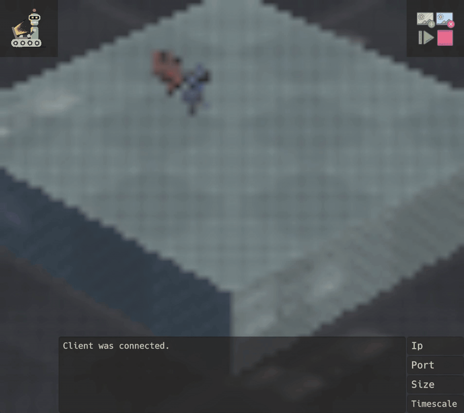
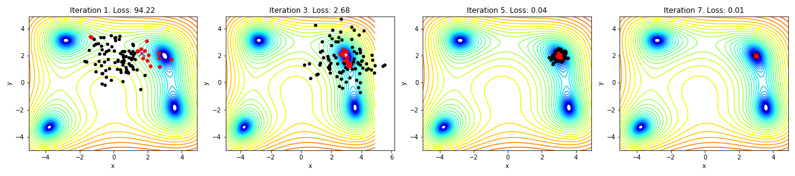

# RU-neurosmash

In this project, we adapted Ha & Schmidhuber's world model (see https://worldmodels.github.io/) to make an agent learn to fight in a Neurosmash gaming environment. 
The world model is trained by distinguishing three components: An encoding which creates a representation of the world, a MDN-RNN which serves as a memory and as a predictive model, and a controller which selects the action the agent will take. 
To make the world model more biologically plausible, we used a natural - instead of a plain evolution strategy to learn the parameters of the controller, resulting in the Natural World Models (NWM). We implemented all modules and compared both strategies. 
We found that neither method performs very well. Reasons as to why this could be the case are outlined in the discussion. 

